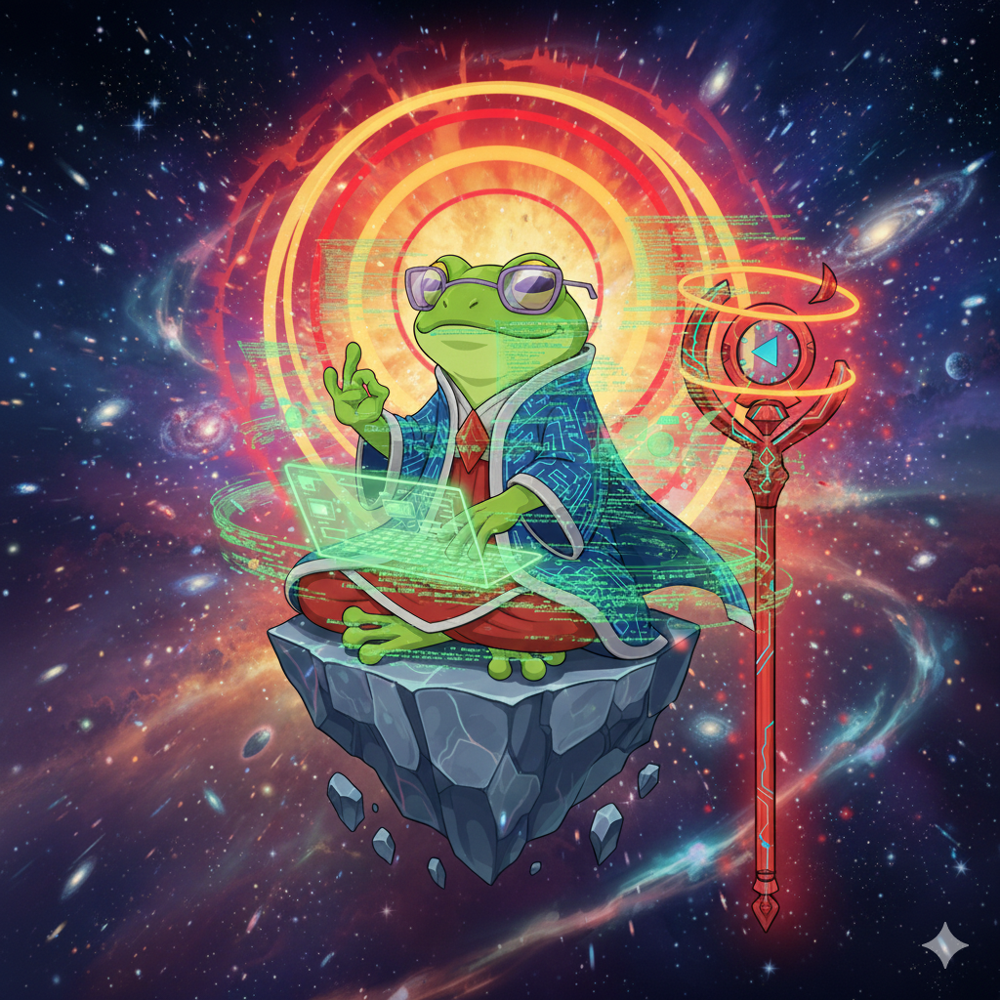

<div align="center">



# Contributing to Aura Frog

### A Plugin for [Claude Code](https://docs.anthropic.com/en/docs/claude-code)

> **Code with main character energy** ✨

</div>

---

Thank you for your interest in contributing to Aura Frog! This is a plugin for **[Claude Code](https://docs.anthropic.com/en/docs/claude-code)** (Anthropic's official CLI for Claude). This guide will help you get started.

---

## 📋 Table of Contents

- [Code of Conduct](#code-of-conduct)
- [Getting Started](#getting-started)
- [Development Setup](#development-setup)
- [Project Structure](#project-structure)
- [Making Changes](#making-changes)
- [Version Management](#version-management)
- [Documentation](#documentation)
- [Testing](#testing)
- [Submitting Changes](#submitting-changes)
- [Release Process](#release-process)

---

## Code of Conduct

This project follows the [Contributor Covenant](https://www.contributor-covenant.org/). By participating, you agree to uphold this code. Please report unacceptable behavior to the project maintainers.

---

## Getting Started

### Prerequisites

- **[Claude Code](https://docs.anthropic.com/en/docs/claude-code)** — Anthropic's agentic coding CLI (this plugin is built for it)
- **Git** — Version control
- **Bash** — For running scripts (macOS/Linux/WSL)
- **jq** — JSON processing (for integration scripts)

### Fork and Clone

```bash
# Fork the repository on GitHub
# Then clone your fork
git clone https://github.com/YOUR-USERNAME/aura-frog.git
cd aura-frog
```

---

## Development Setup

### 1. Install the Plugin Locally

```bash
# In Claude Code, add your local repository as a marketplace
/plugin marketplace add /path/to/your/aura-frog

# Install from your local marketplace
/plugin install aura-frog@local-dev
```

### 2. Create Local Settings

```bash
cd aura-frog
cp settings.example.json settings.local.json
```

### 3. Set Up Environment Variables (Optional)

```bash
cp .envrc.template .envrc
# Edit .envrc with your test credentials
```

---

## Project Structure

```
aura-frog/                           # Repository root
├── aura-frog/                       # Main plugin directory
│   ├── CLAUDE.md                    # Core AI instructions
│   ├── README.md                    # User documentation
│   ├── ccpm-config.yaml             # Configuration file
│   ├── agents/                      # 24 specialized agents
│   ├── commands/                    # 67+ workflow commands
│   ├── docs/                        # Documentation
│   ├── rules/                       # Quality rules
│   ├── skills/                      # Reusable skills
│   ├── templates/                   # Document templates
│   ├── hooks/                       # Workflow hooks
│   ├── scripts/                     # Bash integration scripts
│   └── project-contexts/            # Project templates
├── assets/                          # Logo and images
├── scripts/                         # Development scripts
│   └── sync-version.sh              # Version synchronization
├── CONTRIBUTING.md                  # This file
└── README.md                        # Project overview
```

---

## Making Changes

### Branching Strategy

We use **GitHub Flow**:

1. **main** - Production-ready code
2. **feature/** - New features (`feature/add-python-agent`)
3. **fix/** - Bug fixes (`fix/approval-gate-bug`)
4. **docs/** - Documentation (`docs/update-readme`)
5. **chore/** - Maintenance (`chore/bump-version`)

### Creating a Branch

```bash
git checkout -b feature/your-feature-name
```

### Coding Standards

**File Permissions:**
- Documentation: `644` (rw-r--r--)
- Scripts: `755` (rwxr-xr-x)
- Config files: `644`

**Markdown:**
- Use `##` for main sections, `###` for subsections
- Include code fences with language identifiers
- Keep line length ≤120 characters

**YAML:**
- Use 2-space indentation
- Quote string values
- Comment complex configurations

**Bash Scripts:**
- Use `#!/bin/bash` shebang
- Include error handling: `set -e`
- Add usage documentation in comments
- Use descriptive variable names

---

## Version Management

### Version Format

We use **Semantic Versioning** (SemVer):
- **Major.Minor.Patch** (e.g., `5.0.0`)
- **Suffixes:** `-alpha`, `-beta`, `-rc1`

### Synchronizing Versions

Use the version sync script to update versions across all files:

```bash
# Update to new version
./scripts/sync-version.sh 1.0.0

# Review changes
git diff

# Commit
git commit -am "chore: Bump version to 1.0.0"
```

### Files with Version Numbers

The sync script updates:
- `aura-frog/CLAUDE.md`
- `aura-frog/README.md`
- `aura-frog/ccpm-config.yaml`
- `aura-frog/GET_STARTED.md`
- `aura-frog/TODO.md`
- `README.md`

**Manual Update:**
- `aura-frog/CHANGELOG.md` - Add release notes

---

## Documentation

### Documentation Standards

**Required Sections:**
- Purpose/Overview
- Installation/Setup
- Usage/Examples
- Configuration
- Troubleshooting (if applicable)

**File Headers:**
```markdown
# Document Title

**Version:** X.Y.Z
**Last Updated:** YYYY-MM-DD
**Purpose:** Brief description

---
```

### Documentation Types

1. **User Documentation** (`aura-frog/docs/`)
   - Setup guides
   - Integration guides
   - Troubleshooting

2. **Developer Documentation** (`aura-frog/docs/`)
   - Technical references
   - API documentation
   - Architecture guides

3. **Agent Documentation** (`aura-frog/agents/`)
   - Agent capabilities
   - Configuration
   - Examples

4. **Command Documentation** (`aura-frog/commands/`)
   - Command usage
   - Parameters
   - Examples

### Updating Documentation

When adding features:
1. Update relevant guide in `aura-frog/docs/`
2. Update `aura-frog/README.md` if user-facing
3. Add examples to appropriate files
4. Update CHANGELOG.md

---

## Testing

### Manual Testing

**Before Submitting:**
1. Install plugin locally
2. Test in a sample project
3. Verify all commands work
4. Check documentation accuracy

**Test Checklist:**
```bash
# 1. Plugin installation
/plugin install aura-frog@local-dev

# 2. Project initialization
cd ~/test-project
project:init

# 3. Workflow execution
workflow:start "Test feature"

# 4. Agent activation
agent:list

# 5. Integration scripts (if applicable)
bash aura-frog/scripts/jira-fetch.sh TEST-123
```

### Integration Testing

If modifying bash integration scripts:

```bash
# Set up test environment variables
export JIRA_URL="https://test.atlassian.net"
export JIRA_EMAIL="test@example.com"
export JIRA_API_TOKEN="test-token"

# Run script
bash aura-frog/scripts/jira-fetch.sh TEST-123

# Verify output format
```

---

## Submitting Changes

### Commit Message Format

We use **Conventional Commits**:

```
<type>(<scope>): <description>

[optional body]

[optional footer]
```

**Types:**
- `feat` - New feature
- `fix` - Bug fix
- `docs` - Documentation
- `chore` - Maintenance
- `refactor` - Code refactoring
- `test` - Testing
- `perf` - Performance

**Examples:**
```bash
feat(agents): Add Python backend agent
fix(workflow): Fix approval gate auto-continue
docs(integration): Update JIRA setup guide
chore(deps): Bump version to 1.0.0
```

### Pull Request Process

1. **Create Pull Request**
   - Use clear, descriptive title
   - Reference related issues: `Fixes #123`
   - Provide detailed description

2. **PR Template:**
```markdown
## Description
Brief description of changes

## Type of Change
- [ ] Bug fix
- [ ] New feature
- [ ] Documentation
- [ ] Refactoring

## Testing
- [ ] Manual testing completed
- [ ] Documentation updated
- [ ] No breaking changes

## Checklist
- [ ] Code follows project standards
- [ ] Commit messages follow conventions
- [ ] Documentation updated
- [ ] Version bumped (if needed)
```

3. **Review Process**
   - Address review feedback
   - Keep PR focused and atomic
   - Squash commits if needed

4. **Merge**
   - Maintainer will merge when approved
   - Delete branch after merge

---

## Release Process

### Creating a Release

**For Maintainers:**

1. **Update Version**
```bash
# Sync version across files
./scripts/sync-version.sh 1.0.0

# Update CHANGELOG.md
# Add release date and notes
```

2. **Commit and Tag**
```bash
git add .
git commit -m "chore: Release v1.0.0"
git tag v1.0.0
git push origin main --tags
```

3. **GitHub Release**
   - Go to GitHub Releases
   - Create new release from tag
   - Copy CHANGELOG entry
   - Publish release

4. **Announcement**
   - Update README.md with latest version
   - Notify users (if applicable)

### Release Checklist

- [ ] All tests passing
- [ ] Documentation updated
- [ ] CHANGELOG.md updated
- [ ] Version synchronized
- [ ] Git tag created
- [ ] GitHub release published
- [ ] Plugin marketplace updated

---

## Getting Help

**Questions?**
- 📖 Read the [documentation](aura-frog/docs/)
- 🐛 Check [existing issues](https://github.com/nguyenthienthanh/aura-frog/issues)
- 💬 Open a new issue for discussion

**Found a Bug?**
- 🔍 Search existing issues first
- 📝 Create detailed bug report
- 🧪 Include reproduction steps

**Want a Feature?**
- 💡 Open feature request issue
- 📋 Describe use case
- 🤝 Consider implementing it!

---

## Recognition

Contributors will be recognized in:
- GitHub contributors page
- Release notes (for significant contributions)
- CHANGELOG.md

---

## License

By contributing, you agree that your contributions will be licensed under the MIT License.

---

**Thank you for contributing to Aura Frog Team Agents!** 🚀

Your contributions help make AI-powered project management better for everyone.
