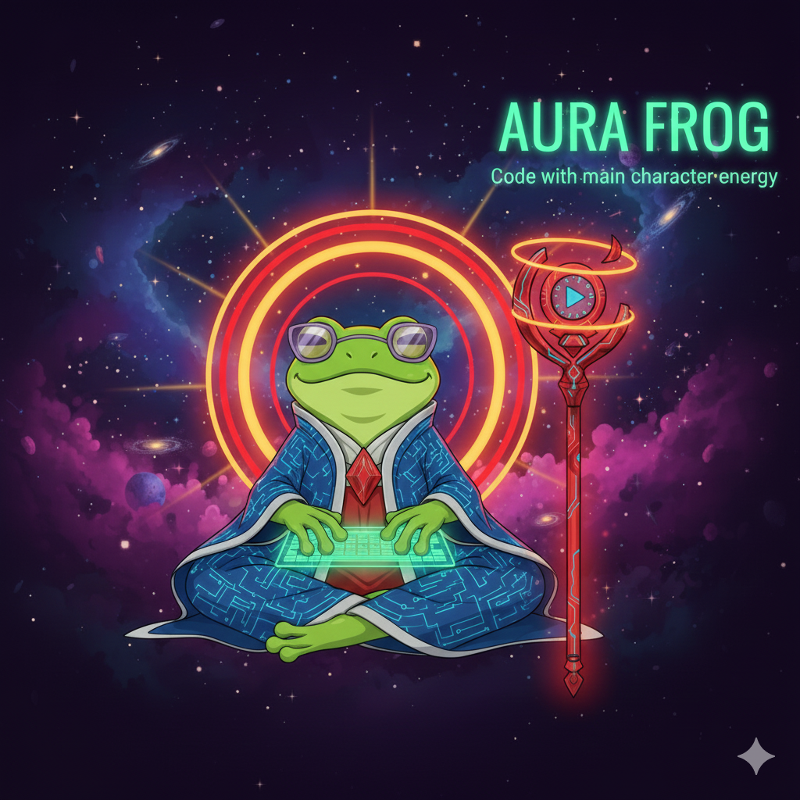

<div align="center">



# 🐸 Aura Frog

### A Plugin for [Claude Code](https://docs.anthropic.com/en/docs/claude-code)

> **Code with main character energy** ✨

AI-powered development plugin for **Claude Code** with 24 specialized agents, 9-phase TDD workflow.

[](aura-frog/CHANGELOG.md)
[](LICENSE)
[](https://docs.anthropic.com/en/docs/claude-code)
[](CONTRIBUTING.md)

[Quick Start](#-quick-start) • [Features](#-key-features) • [Documentation](#-documentation) • [Contributing](#-contributing)

</div>

---

## 📊 At a Glance

<div align="center">

| **Agents** | **Skills** | **Rules** | **Phases** | **Commands** |
|:----------:|:----------:|:---------:|:----------:|:------------:|
| **24** | **20** | **25** | **9** | **70** |

</div>

**What's Inside:**
- 🤖 **24 Specialized Agents** — Mobile, Web, Backend, QA, Security, DevOps, and more
- ⚡ **20 Skills** — 9 auto-invoking + 11 reference skills for specialized tasks
- 📏 **25 Quality Rules** — YAGNI, DRY, error handling, accessibility, and more
- 🔄 **9-Phase Workflow** — From requirements to deployment with quality gates
- 🎮 **70 Commands** — Full workflow control at your fingertips
- 🔗 **4 Integrations** — JIRA, Figma, Slack, Confluence (via Bash scripts)

---

## ⚡ Quick Start

### Prerequisites

- **[Claude Code](https://docs.anthropic.com/en/docs/claude-code)** — Install Anthropic's CLI first
- **Git** — Version control
- **Node.js 18+** or your project's runtime

### Installation

In Claude Code terminal:

```bash
# Step 1: Add Aura Frog Marketplace (one-time)
/plugin marketplace add nguyenthienthanh/aura-frog

# Step 2: Install Aura Frog Plugin
/plugin install aura-frog@aurafrog

# Step 3: Create local settings (required)
cd ~/.claude/plugins/marketplaces/aurafrog/aura-frog/
cp settings.example.json settings.local.json
```

### First Workflow

```bash
# Initialize your project (recommended)
project:init

# Start your first workflow
workflow:start "Implement user authentication"
```

### Follow the Flow

At each phase, review and respond:
- `approve` or `yes` — Continue to next phase
- `reject: <reason>` — Restart current phase
- `modify: <changes>` — Adjust deliverables

**📚 See:** [aura-frog/GET_STARTED.md](aura-frog/GET_STARTED.md) for complete guide

---

## 🎯 Overview

**Aura Frog** is a plugin for **[Claude Code](https://docs.anthropic.com/en/docs/claude-code)** (Anthropic's official CLI for Claude) that transforms it into a **structured development platform** with specialized agents, enforced TDD, and quality gates at every step.

> **What is Claude Code?** Claude Code is Anthropic's agentic coding tool that operates in your terminal, understands your codebase, and helps you code faster through natural conversation. Aura Frog extends Claude Code with structured workflows and specialized agents.

### Why Aura Frog?

| Traditional Development | With Aura Frog |
|------------------------|----------------|
| Manual task management | AI-powered 9-phase workflow |
| Generic AI responses | 24 specialized agents auto-selected |
| Testing as afterthought | TDD enforced (RED → GREEN → REFACTOR) |
| Ad-hoc code review | Multi-agent cross-review built-in |
| Context switching | CLI-first with 70 commands |
| Manual documentation | Auto-generated docs |

**Result:** 60-70% reduction in PM overhead while improving code quality.

---

## 🎨 Key Features

### 🤖 24 Specialized Agents

Agents auto-activate based on your prompt context:

<details>
<summary><b>Development Agents (11)</b></summary>

| Agent | Specialization |
|-------|---------------|
| `mobile-react-native` | React Native + Expo, adaptive styling |
| `mobile-flutter` | Flutter + Dart, cross-platform |
| `web-angular` | Angular 17+, signals, standalone components |
| `web-vuejs` | Vue 3, Composition API, Pinia |
| `web-reactjs` | React 18, hooks, Context API |
| `web-nextjs` | Next.js, SSR, SSG, App Router |
| `backend-nodejs` | Node.js, Express, NestJS, Fastify |
| `backend-python` | Django, FastAPI, Flask |
| `backend-go` | Go, Gin, Fiber, gRPC |
| `backend-laravel` | Laravel PHP, Eloquent |
| `database-specialist` | Schema design, query optimization |

</details>

<details>
<summary><b>Quality, Security & Design (3)</b></summary>

| Agent | Specialization |
|-------|---------------|
| `security-expert` | OWASP audits, vulnerability scanning |
| `qa-automation` | Jest, Cypress, Detox, testing strategies |
| `ui-designer` | UI/UX, Figma integration, accessibility |

</details>

<details>
<summary><b>DevOps & Operations (5)</b></summary>

| Agent | Specialization |
|-------|---------------|
| `devops-cicd` | Docker, K8s, CI/CD, monitoring |
| `jira-operations` | JIRA integration, ticket management |
| `confluence-operations` | Documentation publishing |
| `slack-operations` | Team notifications |
| `voice-operations` | ElevenLabs AI narration |

</details>

<details>
<summary><b>Infrastructure (5)</b></summary>

| Agent | Specialization |
|-------|---------------|
| `smart-agent-detector` | Intelligent agent selection |
| `pm-operations-orchestrator` | Workflow coordination |
| `project-detector` | Auto-detect project type |
| `project-config-loader` | Load configurations |
| `project-context-manager` | Context persistence |

</details>

---

### ⚡ 20 Skills (9 Auto-Invoking + 11 Reference)

Skills activate automatically based on your message context — no commands needed:

```
User: "Implement user profile from PROJ-1234"
         ↓
Auto-invokes:
  1. agent-detector      → Selects mobile-react-native agent
  2. jira-integration    → Fetches PROJ-1234 requirements
  3. project-context-loader → Loads your conventions
  4. workflow-orchestrator  → Executes 9-phase workflow
```

| Skill | Triggers | Purpose |
|-------|----------|---------|
| `agent-detector` | **Every message** | Select appropriate agent |
| `workflow-orchestrator` | "implement", "build", "create" | Execute 9-phase workflow |
| `project-context-loader` | Before code generation | Load project conventions |
| `bugfix-quick` | "fix", "error", "broken" | Fast TDD bug fixes |
| `test-writer` | "add tests", "coverage" | Generate comprehensive tests |
| `code-reviewer` | After implementation | Multi-agent quality review |
| `jira-integration` | PROJ-1234 patterns | Auto-fetch ticket details |
| `figma-integration` | Figma URLs | Extract design components |

**Reference Skills (11):** refactor-expert, api-designer, performance-optimizer, migration-helper, scalable-thinking, documentation, pm-expert, qa-expert, dev-expert, design-expert, nativewind-component-generator

**📚 See:** [skills/README.md](skills/README.md) for complete documentation

---

### 🔄 9-Phase Workflow

```
┌─────────────────────────────────────────────────────────────┐
│  Phase 1: Understand 🎯    →  "What are we building?"       │
│  Phase 2: Design 🏗️        →  "How will we build it?"       │
│  Phase 3: UI Breakdown 🎨  →  "What does it look like?"     │
│  Phase 4: Plan Tests 🧪    →  "How will we test it?"        │
├─────────────────────────────────────────────────────────────┤
│  Phase 5a: Write Tests 🔴  →  TDD RED - Tests must FAIL     │
│  Phase 5b: Build 🟢        →  TDD GREEN - Tests must PASS   │
│  Phase 5c: Polish ♻️       →  TDD REFACTOR - Stay green     │
├─────────────────────────────────────────────────────────────┤
│  Phase 6: Review 👀        →  Multi-agent code review       │
│  Phase 7: Verify ✅        →  QA validation                 │
│  Phase 8: Document 📚      →  Auto-generate docs            │
│  Phase 9: Share 🔔         →  Team notification             │
└─────────────────────────────────────────────────────────────┘
```

**Quality Gates:** Human approval required after every phase — no auto-progression!

---

### 🧪 TDD Enforcement

TDD is **non-negotiable** in Aura Frog:

```
┌─────────┐    ┌─────────┐    ┌───────────┐
│   RED   │ →  │  GREEN  │ →  │ REFACTOR  │
│  Write  │    │  Make   │    │  Improve  │
│  Tests  │    │  Pass   │    │   Code    │
└─────────┘    └─────────┘    └───────────┘
   FAIL           PASS            PASS
```

- ❌ Cannot implement without tests
- ❌ Cannot proceed if tests don't fail (RED)
- ❌ Cannot proceed if tests don't pass (GREEN)
- ❌ Cannot proceed if coverage below 80%

---

### 📏 25 Quality Rules

Aura Frog enforces consistent quality through comprehensive rules:

<details>
<summary><b>Code Quality Rules (8)</b></summary>

| Rule | Purpose |
|------|---------|
| `yagni-principle` | Only implement what's needed now |
| `dry-with-caution` | Rule of Three before abstracting |
| `kiss-avoid-over-engineering` | Keep it simple |
| `error-handling-standard` | Typed errors, proper logging |
| `logging-standards` | Structured logging, sanitization |
| `code-quality` | TypeScript strict, no any |
| `naming-conventions` | Consistent naming |
| `smart-commenting` | Why, not what |

</details>

<details>
<summary><b>Architecture Rules (5)</b></summary>

| Rule | Purpose |
|------|---------|
| `api-design-rules` | RESTful conventions |
| `state-management` | React/Vue state patterns |
| `dependency-management` | Version pinning, audits |
| `performance-rules` | Optimization guidelines |
| `theme-consistency` | Design system adherence |

</details>

<details>
<summary><b>Workflow Rules (5)</b></summary>

| Rule | Purpose |
|------|---------|
| `tdd-workflow` | RED → GREEN → REFACTOR |
| `cross-review-workflow` | Multi-agent review |
| `approval-gates` | Human approval required |
| `git-workflow` | Commit conventions |
| `safety-rules` | Security guidelines |

</details>

<details>
<summary><b>Accessibility & UI Rules (3)</b></summary>

| Rule | Purpose |
|------|---------|
| `accessibility-rules` | WCAG compliance, ARIA |
| `correct-file-extensions` | Proper file naming |
| `direct-hook-access` | Lifecycle hooks |

</details>

**📚 See:** [rules/](rules/) for all rule definitions

---

## 🔄 Workflow Modes

### Full 9-Phase Workflow

```bash
workflow:start "Your complex task"
```

**Best for:** New features, complex changes, production code
**Time:** 2-4 hours | **Quality:** Maximum ✅

### Lightweight Commands

```bash
bugfix:quick "Fix login button"    # 30 min
refactor "src/utils/api.ts"        # 1 hour
planning "new feature"             # 30 min
document "API endpoints"           # 30 min
```

**Best for:** Small bugs, documentation, simple refactors
**Time:** 30 min - 1 hour | **Quality:** Good ✅

---

## 📋 Commands Reference

<details>
<summary><b>Workflow Commands</b></summary>

| Command | Description |
|---------|-------------|
| `workflow:start <task>` | Start full 9-phase workflow |
| `workflow:status` | Show current progress |
| `workflow:approve` | Approve current phase |
| `workflow:reject <reason>` | Reject and restart phase |
| `workflow:handoff` | Save for session continuation |
| `workflow:resume [id]` | Resume saved workflow |

</details>

<details>
<summary><b>Quick Commands</b></summary>

| Command | Description |
|---------|-------------|
| `bugfix:quick <desc>` | Quick bug fix with TDD |
| `bugfix:hotfix <desc>` | Emergency hotfix |
| `refactor <file>` | Code refactoring |
| `planning <task>` | Create execution plan |
| `document <feature>` | Generate documentation |

</details>

<details>
<summary><b>Testing Commands</b></summary>

| Command | Description |
|---------|-------------|
| `test:unit <file>` | Generate unit tests |
| `test:e2e <flow>` | Generate E2E tests |
| `test:coverage` | Check coverage |

</details>

<details>
<summary><b>Project Commands</b></summary>

| Command | Description |
|---------|-------------|
| `project:init` | Initialize Aura Frog for project |
| `project:detect` | Auto-detect project type |
| `project:regen` | Re-generate context |
| `agent:list` | Show all agents |
| `agent:info <name>` | Show agent details |

</details>

**📚 See:** [commands/README.md](commands/README.md) for all 70 commands

---

## 🔗 Integrations

Aura Frog includes native Bash script integrations:

| Integration | Purpose | Auto-Trigger |
|-------------|---------|--------------|
| **JIRA** | Fetch tickets, update status | `PROJ-1234` in message |
| **Figma** | Extract designs, components | Figma URL in message |
| **Slack** | Send notifications | Phase 9 completion |
| **Confluence** | Publish documentation | Phase 8 completion |

```bash
# Auto-fetch JIRA ticket requirements
workflow:start "Implement PROJ-1234"

# Auto-fetch Figma design
workflow:start "Build https://figma.com/file/ABC123/Design"
```

**📚 Setup:** [docs/INTEGRATION_SETUP_GUIDE.md](docs/INTEGRATION_SETUP_GUIDE.md)

---

## 📚 Documentation

### Getting Started

| Document | Description |
|----------|-------------|
| [GET_STARTED.md](GET_STARTED.md) | Quick start guide (5 minutes) |
| [docs/PLUGIN_INSTALLATION.md](docs/PLUGIN_INSTALLATION.md) | Official installation guide |
| [TESTING_GUIDE.md](TESTING_GUIDE.md) | Testing workflows |

### Core Documentation

| Document | Description |
|----------|-------------|
| [CLAUDE.md](CLAUDE.md) | AI instructions (for Claude) |
| [docs/phases/](docs/phases/) | 9 detailed phase guides |
| [docs/RULES_COMBINATION.md](docs/RULES_COMBINATION.md) | How rules are combined |
| [skills/README.md](skills/README.md) | Skills system guide |

### Reference

| Document | Description |
|----------|-------------|
| [commands/README.md](commands/README.md) | All 70 commands |
| [agents/](agents/) | All agent definitions |
| [rules/](rules/) | Core quality rules |

---

## 🏗️ Architecture

```
aura-frog/                           # Repository root
├── aura-frog/                       # Main plugin directory
│   ├── agents/                      # 24 specialized agents
│   ├── skills/                      # 20 skills (9 auto + 11 reference)
│   ├── commands/                    # 70 workflow commands
│   ├── rules/                       # 25 quality rules
│   ├── docs/                        # Comprehensive documentation
│   │   └── phases/                  # 9 phase guides
│   ├── hooks/                       # Lifecycle hooks
│   ├── scripts/                     # Integration scripts
│   └── templates/                   # Document templates
├── assets/                          # Logo and images
├── scripts/                         # Development scripts
└── README.md                        # This file
```

### Rules Priority

```
Project Context > Aura Frog Core Rules > Generic Defaults
```

Your project conventions always win over Aura Frog defaults.

---

## 🤝 Contributing

Contributions welcome! Here's how you can help:

| Priority | Area | Description |
|----------|------|-------------|
| 🔴 High | Agents | Add new specialized agents |
| 🔴 High | Skills | Create new auto-invoking skills |
| 🟡 Medium | Commands | Add workflow commands |
| 🟡 Medium | Docs | Improve documentation |
| 🟢 Low | Templates | Add document templates |

Submit issues or pull requests to [GitHub](https://github.com/nguyenthienthanh/aura-frog)

---

## 📄 License

MIT License — See [LICENSE](LICENSE) for details

---

## 🙏 Acknowledgments

- **[Claude Code](https://claude.ai)** — AI-powered development platform
- **[duongdev/ccpm](https://github.com/duongdev/ccpm)** — Original inspiration
- **Contributors** — Development and testing

---

<div align="center">

**Code with main character energy! 🐸✨**

[Get Started](aura-frog/GET_STARTED.md) • [Documentation](aura-frog/docs/) • [Report Issue](https://github.com/nguyenthienthanh/aura-frog/issues)

---

*Built with ❤️ by [@nguyenthienthanh](https://github.com/nguyenthienthanh)*

</div>
