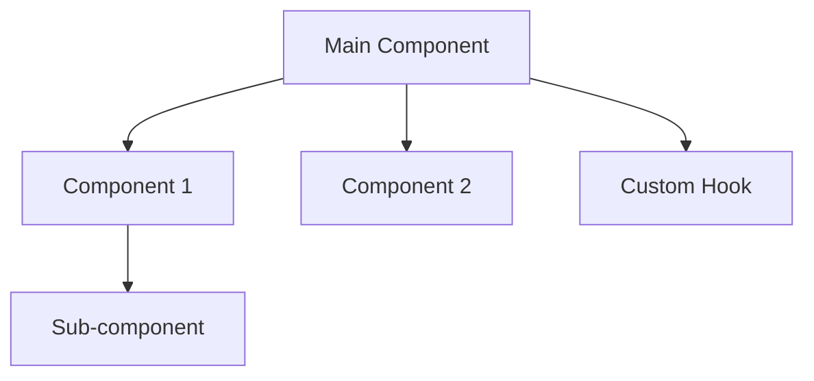

# Command: workflow:phase:2

**Version:** 1.0.0  
**Purpose:** Execute Phase 2 - Technical Planning  
**Trigger:** Auto-triggered after Phase 1 approval OR manual `/workflow:phase:2`

---

## 🎯 Phase 2 Objectives

Create detailed technical specification and architecture plan for implementation.

**Deliverables:**
1. Technical Specification (TECH_SPEC.md)
2. Architecture Diagram
3. Component/Module Breakdown
4. API Design (if applicable)
5. File Change List

---

## 📋 Execution Steps

### Step 1: Pre-Phase Hook
- Load Phase 1 requirements
- Verify previous phase approved
- Initialize Phase 2 state
- Show phase banner

### Step 2: Analyze Codebase
**Primary Agent:** Dev agent (mobile-react-native/web-*/backend-laravel)

Actions:
- Read existing code structure
- Identify similar patterns in codebase
- Analyze dependencies
- Review project conventions

### Step 3: Design Architecture
**Agents:** Dev agent + UI Designer (if UI changes)

Create:
- High-level architecture
- Component hierarchy
- Data flow diagram
- State management strategy
- File/folder structure

### Step 4: Define Technical Details
- Props/interfaces for each component
- API contracts (request/response)
- Database schema changes (if backend)
- Third-party integrations
- Performance considerations

### Step 5: Estimate Complexity
- File changes count
- Lines of code estimate
- Dependencies to add/update
- Potential risks
- **Story Points** (Fibonacci: 1, 2, 3, 5, 8, 13, 21)
- **Time estimate** (hours/days)

### Step 6: Generate Deliverables
Create comprehensive tech spec document:

```markdown
# Technical Specification

## Overview
[Brief description]

## Architecture
[Architecture diagram in ASCII/mermaid]

## Components/Modules
### Component 1
- Purpose: ...
- Props: ...
- State: ...
- Dependencies: ...

## File Changes
- CREATE: path/to/new/file.tsx
- UPDATE: path/to/existing/file.tsx
- DELETE: path/to/old/file.tsx

## API Design (if applicable)
### Endpoint 1
- Method: POST
- Path: /api/v1/resource
- Request: {...}
- Response: {...}

## Database Changes (if applicable)
[Schema changes]

## Dependencies
- Add: package@version
- Update: package@version

## Testing Strategy
[High-level test plan]

## Risks & Mitigation
[Potential issues and solutions]

## Estimation
### Story Points
**Total:** X story points (Fibonacci scale)

**Breakdown:**
- Phase 4 (Test Planning): 1 point
- Phase 5a (Write Tests): 2 points
- Phase 5b (Implementation): 5 points
- Phase 5c (Refactor): 2 points
- Phase 6 (Code Review): 1 point
- Phase 7 (QA Verification): 2 points

**Confidence:** High/Medium/Low

**Story Point Reference:**
- 1 point: Trivial (~1-2 hours)
- 2 points: Simple (~2-4 hours)
- 3 points: Moderate (~4-6 hours)
- 5 points: Complex (~1 day)
- 8 points: Very Complex (~2 days)
- 13 points: Extensive (~3 days)
- 21 points: Epic (consider breaking down)

### Time Estimate
- Phase 4-5: X hours
- Phase 6-7: Y hours
- **Total:** Z hours (~W days)

**Velocity Factor:** Based on team velocity (adjust for your team)
```

---

## 🎨 Architecture Diagram Format

Use ASCII art or Mermaid syntax:

```
┌─────────────────┐
│  Main Component │
└────────┬────────┘
         │
    ┌────┴────┬────────────┬──────────┐
    │         │            │          │
┌───▼───┐ ┌──▼──┐ ┌───────▼──┐ ┌────▼────┐
│ Comp1 │ │Comp2│ │  Comp3   │ │  Hook   │
└───────┘ └─────┘ └──────────┘ └─────────┘
```

Or Mermaid:


---

## 📦 Template Usage

Uses `templates/tech-spec.md` as base template.

Customize for:
- Mobile (React Native)
- Web (Vue/React/Next.js)
- Backend (Laravel/API)

---

## ✅ Success Criteria

Phase 2 is complete when:
- [ ] Architecture defined clearly
- [ ] All components/modules listed
- [ ] Props/interfaces specified
- [ ] File changes identified
- [ ] Dependencies listed
- [ ] Risks identified
- [ ] Timeline estimated
- [ ] Tech spec document created
- [ ] Diagram included

---

## 🚦 Approval Gate

```
═══════════════════════════════════════════════════════════
🎯 PHASE 2 COMPLETE: Technical Planning
═══════════════════════════════════════════════════════════

📊 Summary:
Created technical specification with architecture design

📦 Deliverables:
   📄 TECH_SPEC.md (architecture, components, API design)
   📊 architecture-diagram.png

📈 Metrics:
   - Components to create: 5
   - Files to change: 8 files
   - New dependencies: 2 packages
   - Story Points: 8 points (Complex)
   - Estimated effort: 1-2 days (~12-16 hours)
   - Confidence: High

✅ Success Criteria:
   ✅ Architecture clearly defined
   ✅ Component breakdown complete
   ✅ File changes identified
   ✅ Risks assessed

⏭️  Next Phase: Phase 3 - Design Review

───────────────────────────────────────────────────────────
⚠️  ACTION REQUIRED

Type "/workflow:approve" → Proceed to Phase 3
Type "/workflow:reject" → Restart Phase 2
Type "/workflow:modify <feedback>" → Refine tech spec

Your response:
═══════════════════════════════════════════════════════════
```

---

## 🔄 If Rejected

User can provide feedback:
```
/workflow:reject Need to reconsider state management approach
```

Agent will:
1. Read feedback
2. Re-analyze architecture
3. Update tech spec
4. Show approval gate again

---

## 📂 Files Created

```
logs/contexts/{workflow-id}/deliverables/
└── PHASE_2_TECH_SPEC.md (comprehensive tech spec)
```

---

## 🎯 What Happens Next

After approval:
- `/workflow:phase:3` - Design Review (if UI changes)
- Or skip to `/workflow:phase:4` - Test Planning

---

**Status:** Active command  
**Related:** workflow:phase:1, workflow:phase:3, workflow:approve

