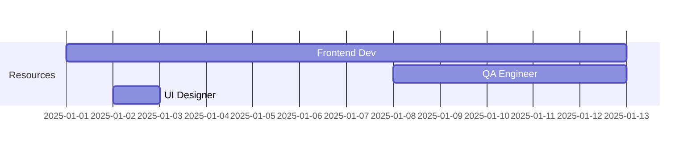

# Skill: Project Planning

**Category:** PM Expert  
**Priority:** High  
**Used By:** pm-operations-orchestrator

---

## Overview

Plan, schedule, and coordinate project activities to ensure successful delivery within scope, time, and quality constraints.

---

## Core Capabilities

### 1. Scope Definition

**Define project boundaries clearly:**

```markdown
# Project Scope: Social Media Sharing Feature

## In Scope ✅
- Facebook post sharing (text + images)
- Instagram post sharing (images + captions)
- LinkedIn post sharing (text + images)
- Image formats: PNG, JPG, WebP
- Error handling and retry logic
- Post history tracking
- Multi-region support (PH, MY, ID, IB, HK)
- Phone and tablet variants

## Out of Scope ❌
- Twitter/X integration (Phase 2)
- Video support (Future consideration)
- Post scheduling (Separate epic)
- Analytics dashboard (Q2 2025)
- Third-party content discovery
- Automated posting
- Comment management

## Assumptions
- Users have social media accounts linked
- Backend API for social integration exists
- OAuth tokens are managed separately
- Network connectivity available

## Constraints
- Must complete in 2 weeks
- Team of 2 developers
- Must support devices from iOS 13+, Android 8+
- Must follow company brand guidelines
```

### 2. Work Breakdown Structure (WBS)

**Break project into manageable tasks:**

```markdown
# WBS: Social Media Sharing Feature

## 1. Requirements (Phase 1)
├── 1.1 Stakeholder interviews
├── 1.2 Requirement documentation
├── 1.3 Acceptance criteria definition
└── 1.4 Requirement review & approval

## 2. Technical Planning (Phase 2)
├── 2.1 Architecture design
├── 2.2 Component breakdown
├── 2.3 API integration planning
├── 2.4 Data model design
└── 2.5 Tech spec review

## 3. Design Review (Phase 3)
├── 3.1 Figma design analysis
├── 3.2 Component specifications
├── 3.3 Design token extraction
├── 3.4 Responsive variants
└── 3.5 Design approval

## 4. Test Planning (Phase 4)
├── 4.1 Test strategy definition
├── 4.2 Test case creation (53 cases)
├── 4.3 Coverage goals setup
├── 4.4 Test environment preparation
└── 4.5 Test plan review

## 5. Implementation (Phase 5)
├── 5.1 TDD RED: Write failing tests
├── 5.2 TDD GREEN: Implement features
│   ├── 5.2.1 ShareModal component
│   ├── 5.2.2 Platform adapters (FB, IG, LI)
│   ├── 5.2.3 API integration
│   └── 5.2.4 State management
└── 5.3 TDD REFACTOR: Code optimization

## 6. Code Review (Phase 6)
├── 6.1 Self-review
├── 6.2 Cross-agent review
├── 6.3 Security review
└── 6.4 Performance review

## 7. QA Validation (Phase 7)
├── 7.1 Test execution
├── 7.2 Coverage analysis
├── 7.3 Bug fixing
└── 7.4 Final validation

## 8. Documentation (Phase 8)
├── 8.1 Implementation summary
├── 8.2 API documentation
├── 8.3 User guide
└── 8.4 Confluence publication

## 9. Notification (Phase 9)
├── 9.1 Slack notifications
├── 9.2 JIRA updates
└── 9.3 Stakeholder communication
```

### 3. Timeline Estimation

**Estimate effort for each task:**

**Estimation Techniques:**

1. **Story Points (Fibonacci):**
```
1 point = 2-4 hours (very simple)
2 points = 4-8 hours (simple)
3 points = 1-2 days (moderate)
5 points = 2-3 days (complex)
8 points = 3-5 days (very complex)
13 points = 1 week+ (needs breakdown)
```

2. **Three-Point Estimation:**
```
Estimate = (Optimistic + 4×Most Likely + Pessimistic) / 6

Example: ShareModal Component
Optimistic: 4 hours
Most Likely: 8 hours
Pessimistic: 16 hours

Estimate = (4 + 4×8 + 16) / 6 = 52 / 6 = 8.7 hours ≈ 1 day
```

**Estimation Table:**

```markdown
# Effort Estimates: Social Media Sharing

| Phase | Task | Estimate | Confidence | Notes |
|-------|------|----------|------------|-------|
| 1 | Requirements | 4h | HIGH | Clear scope |
| 2 | Tech Planning | 8h | HIGH | Similar to past features |
| 3 | Design Review | 4h | MEDIUM | Depends on design quality |
| 4 | Test Planning | 6h | HIGH | 53 test cases estimated |
| 5a | Write Tests | 8h | MEDIUM | Depends on complexity |
| 5b | Implementation | 32h | MEDIUM | 3-4 components + integration |
| 5c | Refactoring | 4h | HIGH | Code optimization |
| 6 | Code Review | 4h | HIGH | Standard process |
| 7 | QA Validation | 8h | MEDIUM | Depends on bug count |
| 8 | Documentation | 4h | HIGH | Templates available |
| 9 | Notification | 1h | HIGH | Automated |

**Total Effort:** 83 hours (10.4 days)
**Buffer (20%):** +17 hours (2.1 days)
**Final Estimate:** 100 hours (12.5 days ~ 2.5 weeks)
```

### 4. Schedule Development

**Create project timeline:**

```markdown
# Project Schedule: PROJ-1234

## Timeline: 2.5 weeks (12.5 working days)

### Week 1 (Days 1-5)
**Mon-Tue (2 days):**
- Phase 1: Requirements Analysis (4h)
- Phase 2: Technical Planning (8h)
- Phase 3: Design Review (4h)

**Wed-Thu (2 days):**
- Phase 4: Test Planning (6h)
- Phase 5a: Write Failing Tests (8h)

**Fri (1 day):**
- Buffer day / Catch up
- Sprint review

### Week 2 (Days 6-10)
**Mon-Thu (4 days):**
- Phase 5b: Implementation (32h)
  - ShareModal: 1 day
  - Platform adapters: 1.5 days
  - API integration: 1 day
  - State management: 0.5 day

**Fri (1 day):**
- Phase 5c: Refactoring (4h)
- Phase 6: Code Review (4h)

### Week 3 (Days 11-12.5)
**Mon-Tue (2 days):**
- Phase 7: QA Validation (8h)
- Bug fixes (buffer)

**Wed AM (0.5 day):**
- Phase 8: Documentation (4h)
- Phase 9: Notification (1h)
- Project close

## Milestones
- ✅ M1: Requirements Approved (Day 1)
- ⏳ M2: Design Approved (Day 2)
- ⏳ M3: Tests Written (Day 4)
- ⏳ M4: Implementation Complete (Day 10)
- ⏳ M5: QA Passed (Day 12)
- ⏳ M6: Production Ready (Day 12.5)

## Dependencies
- Social media API credentials (Ready)
- Figma designs (Available Day 2)
- QA environment (Available Day 7)
```

### 5. Resource Planning

**Allocate resources effectively:**

```markdown
# Resource Plan

## Team Composition
- **Frontend Developer (Mobile):** 100% allocated (2.5 weeks)
- **QA Engineer:** 40% allocated (testing phase only)
- **UI Designer:** 10% allocated (design review only)
- **Backend Developer:** 0% (API already exists)
- **PM:** 20% allocated (coordination)

## Resource Availability
| Resource | Availability | Vacation | Capacity |
|----------|--------------|----------|----------|
| Dev 1 (Mobile) | 100% | None | 40h/week |
| QA Engineer | 40% | None | 16h/week |
| UI Designer | 10% | None | 4h/week |

## Resource Allocation by Phase


## Skill Requirements
- ✅ React Native (Required) - Dev 1 ✅
- ✅ TypeScript (Required) - Dev 1 ✅
- ✅ Jest/Testing (Required) - Dev 1 ✅, QA ✅
- ✅ Social Media APIs (Nice to have) - Dev 1 can learn
- ✅ Figma (Required) - UI Designer ✅
```

### 6. Critical Path Analysis

**Identify critical path:**

```markdown
# Critical Path: Social Media Sharing

## Critical Tasks (Cannot be delayed)
1. Phase 1: Requirements (4h) → START
2. Phase 2: Tech Planning (8h) → depends on Phase 1
3. Phase 4: Test Planning (6h) → depends on Phase 2
4. Phase 5a: Write Tests (8h) → depends on Phase 4
5. Phase 5b: Implementation (32h) → depends on Phase 5a
6. Phase 7: QA Validation (8h) → depends on Phase 5b
7. END

**Critical Path Duration:** 66 hours (8.25 days)
**Project Duration:** 100 hours (12.5 days)
**Float:** 34 hours (4.25 days)

## Non-Critical Tasks (Have slack)
- Phase 3: Design Review (can parallel with Phase 4)
- Phase 5c: Refactoring (can adjust if needed)
- Phase 6: Code Review (can overlap with QA)
- Phase 8: Documentation (can parallel with Phase 7)

## Impact of Delays
- 1 day delay in critical path → 1 day project delay
- 1 day delay in non-critical → No project impact (if within float)
```

### 7. Risk and Buffer Management

**Plan for uncertainties:**

```markdown
# Buffer Strategy

## Time Buffers
- **Task Buffers:** Included in estimates (worst case)
- **Phase Buffer:** 20% of phase duration
- **Project Buffer:** 3 days at end

## Buffer Consumption Monitoring
Week 1: Expected 25% buffer used
Week 2: Expected 50% buffer used  
Week 3: Expected 75% buffer used

If >50% buffer consumed early → Red flag!

## Risk Mitigation in Schedule
- High-risk tasks: Add 30% buffer
- Medium-risk tasks: Add 20% buffer
- Low-risk tasks: Add 10% buffer

## Example: Implementation Phase (High Risk)
- Base estimate: 32h
- Risk buffer: +9.6h (30%)
- Total scheduled: 42h (rounded to 2 weeks)
```

### 8. Progress Tracking

**Monitor project progress:**

```markdown
# Progress Dashboard

## Overall Status
**Completion:** 44% (Phase 4 of 9 complete)
**Timeline:** ON TRACK ✅
**Budget:** WITHIN BUDGET ✅
**Quality:** ON TARGET ✅

## Phase Status
- ✅ Phase 1: Requirements (100% - APPROVED)
- ✅ Phase 2: Technical Planning (100% - APPROVED)
- ✅ Phase 3: Design Review (100% - APPROVED)
- 🔄 Phase 4: Test Planning (80% - IN PROGRESS)
- ⏸️ Phase 5-9: Not started

## Velocity Tracking
**Planned velocity:** 40h/week
**Actual velocity:** 38h/week (Week 1)
**Efficiency:** 95% (good)

## Earned Value Analysis
**Planned Value (PV):** 40 hours
**Earned Value (EV):** 38 hours  
**Actual Cost (AC):** 40 hours

**Schedule Performance Index (SPI):** 0.95 (slightly behind)
**Cost Performance Index (CPI):** 0.95 (slightly over budget)

**Interpretation:** Minor delay, course correction needed
```

### 9. Change Management

**Handle scope/schedule changes:**

```markdown
# Change Control Process

## Change Request Form

**CR-001: Add Video Support**

**Requested By:** Product Manager
**Date:** 2025-01-05
**Priority:** MEDIUM

**Description:**
Add support for video posts (MP4, MOV) in addition to images.

**Impact Analysis:**
- **Scope:** +30% (new feature)
- **Timeline:** +5 days
- **Resources:** Same team
- **Budget:** +$3K (dev time)
- **Quality:** Additional test cases needed (+15)
- **Risk:** MEDIUM (video processing complexity)

**Dependencies:**
- None (independent feature)

**Options:**
1. **Approve:** Add to current sprint (+5 days delay)
2. **Defer:** Move to Phase 2 (no delay)
3. **Reject:** Out of scope

**Recommendation:** DEFER to Phase 2
- Maintains current timeline
- Allows proper planning for video feature
- Reduces risk in current sprint

**Decision:** [Pending stakeholder approval]

**Impact on Schedule if Approved:**
- New delivery date: +5 days
- All downstream tasks delayed
- Sprint 2 start delayed
```

---

## Planning Throughout Workflow

### Before Phase 1: Pre-Planning
- Initial scope definition
- Resource availability check
- Timeline estimation
- Stakeholder alignment

### Phase 1-2: Detailed Planning
- Work breakdown
- Effort estimation
- Schedule creation
- Risk planning

### Phase 3-9: Execution & Monitoring
- Progress tracking
- Variance analysis
- Schedule adjustments
- Change management

---

## Best Practices

### Do's ✅
- ✅ Involve team in estimation
- ✅ Add realistic buffers
- ✅ Document assumptions
- ✅ Track progress daily
- ✅ Communicate delays early
- ✅ Learn from past projects
- ✅ Update plan regularly

### Don'ts ❌
- ❌ Pad estimates excessively
- ❌ Ignore historical data
- ❌ Over-optimize schedule
- ❌ Forget dependencies
- ❌ Skip buffer planning
- ❌ Ignore team capacity
- ❌ Set unrealistic deadlines

---

## Planning Templates

See `templates/` for:
- Project plan template
- WBS template
- Resource plan template
- Schedule template

---

## Integration with Other Skills

Works closely with:
- **Risk Management** - Factor risks into planning
- **Stakeholder Management** - Align plans with expectations
- **Requirement Analysis** - Scope definition

---

**Used by PM Operations Orchestrator to plan and coordinate the 9-phase workflow effectively.**

