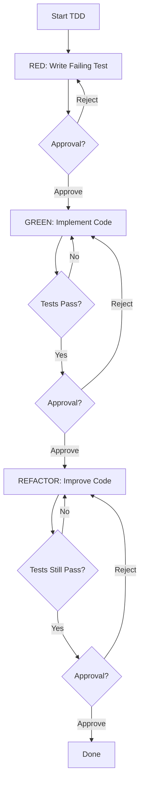

# Skill: TDD Implementation

**Skill ID:** `tdd-implementation`  
**Category:** Development  
**Priority:** High

---

## Purpose

Enforce Test-Driven Development workflow: write tests first, implement code to pass tests, then refactor.

---

## Capabilities

### 1. Test Generation
- Generate test cases from requirements
- Create test stubs
- Mock external dependencies
- Setup test fixtures

### 2. Coverage Enforcement
- Block code generation without tests
- Monitor coverage in real-time
- Report coverage gaps
- Suggest additional tests

### 3. TDD Workflow Management
- Guide through RED → GREEN → REFACTOR
- Approval gates at each step
- Verify tests fail before implementation
- Verify tests pass after implementation

---

## Agents with This Skill

- `qa-automation` (Primary)
- `mobile-react-native` (Implementation)
- `web-vuejs` (Implementation)
- `web-reactjs` (Implementation)
- `web-nextjs` (Implementation)
- `backend-laravel` (Implementation)

---

## Auto-Invoked When

- Phase 5: Implementation starts
- User requests code generation
- Coverage drops below threshold

---

## TDD Workflow



---

## Implementation

### Step 1: RED Phase
```typescript
async function redPhase(context: TDDContext) {
  // 1. Generate test cases
  const tests = await generateTests(context.requirements);
  
  // 2. Write test files
  await writeTestFiles(tests);
  
  // 3. Run tests (should fail)
  const result = await runTests();
  
  if (result.allPassed) {
    throw new Error('Tests should fail in RED phase!');
  }
  
  // 4. Request approval
  await requestApproval(`
    🔴 RED Phase Complete
    
    Tests written: ${tests.length}
    All tests failing: ✅ (expected)
    
    Ready to proceed with implementation?
  `);
}
```

### Step 2: GREEN Phase
```typescript
async function greenPhase(context: TDDContext) {
  // 1. Implement minimum code
  await implementCode(context.specification);
  
  // 2. Run tests
  const result = await runTests();
  
  if (!result.allPassed) {
    throw new Error(`Tests still failing: ${result.failures}`);
  }
  
  // 3. Check coverage
  const coverage = await checkCoverage();
  
  if (coverage < context.threshold) {
    await suggestAdditionalTests(coverage);
  }
  
  // 4. Request approval
  await requestApproval(`
    🟢 GREEN Phase Complete
    
    All tests passing: ✅ (${result.total}/${result.total})
    Coverage: ${coverage}% (Target: ${context.threshold}%)
    
    Ready to refactor?
  `);
}
```

### Step 3: REFACTOR Phase
```typescript
async function refactorPhase(context: TDDContext) {
  // 1. Improve code quality
  await refactorCode();
  
  // 2. Run tests again
  const result = await runTests();
  
  if (!result.allPassed) {
    throw new Error('Tests broken during refactoring!');
  }
  
  // 3. Run linter
  const lintResult = await runLinter();
  
  if (lintResult.warnings > 0) {
    await fixLinterIssues();
  }
  
  // 4. Request approval
  await requestApproval(`
    ♻️ REFACTOR Phase Complete
    
    Tests still passing: ✅
    Linter warnings: 0
    Code quality improved: ✅
    
    TDD cycle complete!
  `);
}
```

---

## Blocking Rules

### Block if:
- No test file exists for implementation
- Tests not written before code
- Coverage below threshold
- Tests don't fail in RED phase
- Tests don't pass in GREEN phase

---

## Coverage Thresholds

```yaml
default: 80%

by_file_type:
  critical_business_logic: 90%
  ui_components: 70%
  utility_functions: 95%
  api_clients: 85%
  hooks: 85%

exemptions:
  - config files
  - type definitions
  - constants
  - mock data
```

---

## Deliverables

- Test files (`.test.tsx`, `.test.ts`, `.spec.php`)
- Coverage reports (`coverage/index.html`)
- Test execution logs

---

## Quality Checks

- [ ] Tests written before code
- [ ] Tests fail in RED phase
- [ ] Tests pass in GREEN phase
- [ ] Coverage meets threshold
- [ ] Edge cases tested
- [ ] Linter passes

---

## Related Skills

- `test-planning` - Plan test strategy
- `code-review` - Review test quality
- `qa-validation` - Validate tests

---

**Version:** 1.0.0  
**Last Updated:** 2025-11-23

